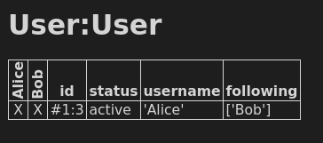

All DAML update actions that work on contract IDs also have a counter part for contract keys:

| Contract ID | Contract Key  |
|-------------|---------------|
| fetch       | fetchByKey    |
| lookup      | lookupByKey   |
| exercise    | exerciseByKey |

Let's try these out in a scenario. First, we let `Alice` exercise the `Follow` choice with
`exerciseByKey`:

<pre class="file" data-filename="daml/User.daml" data-target="append">
test = scenario do
  alice <- getParty "Alice"
  bob <- getParty "Bob"
  submit alice $ create User with username=alice, following=[]
  submit alice $ exerciseByKey @User alice $ Follow bob
</pre>

- `exerciseByKey` takes as a first argument the template name of the contract we want to exercise a
  choice on preceded by an `@`
- the second argument is the contract key, in this case `alice`

You can see that `Alice` is now following in the scenario output when you click on `scenario results`:

We can also check this by fetching the contract with `fetchByKey`:

<pre class="file" data-filename="daml/User.daml" data-target="append">
  (aliceCid1, aliceUser) <- submit alice $ fetchByKey @User alice
  assert $ aliceUser == User with username=alice, following=[bob]
  return ()
</pre>

- `fetchByKey` takes as first argument the template name, here `@User`, and as a second argument
  the contract key
- it returns a tuple, where the first factor is the actual contract ID and the second factor is the
  contract data

`lookupByKey` is similar to `fetchByKey`, but instead of failing the transaction, it will returns a
`None` if the given key does not exist.

Remove the last line and append

<pre class="file" data-filename="daml/User.daml" data-target="append">
  Some aliceCid2 <- submit alice $ lookupByKey @User alice
  assert $ aliceCid1 == aliceCid2
  return ()
</pre>

- The first argument to `lookupByKey` is the template name and the second the contract key
- Since we didn't exercise an choice on `Alice` `User` contract, we expect the returned contract ID
to be unchanged

`lookupByKey` does not give any information of whether a contract with a given key exists or not.
If it returns `None`, that means either there is no active contract with that key or the submitting
party is simply not observing it.

Finally, `lookupByKey` is slightly different from it's `lookup` counterpart, in that it needs to be
authorized by all key maintainers.
