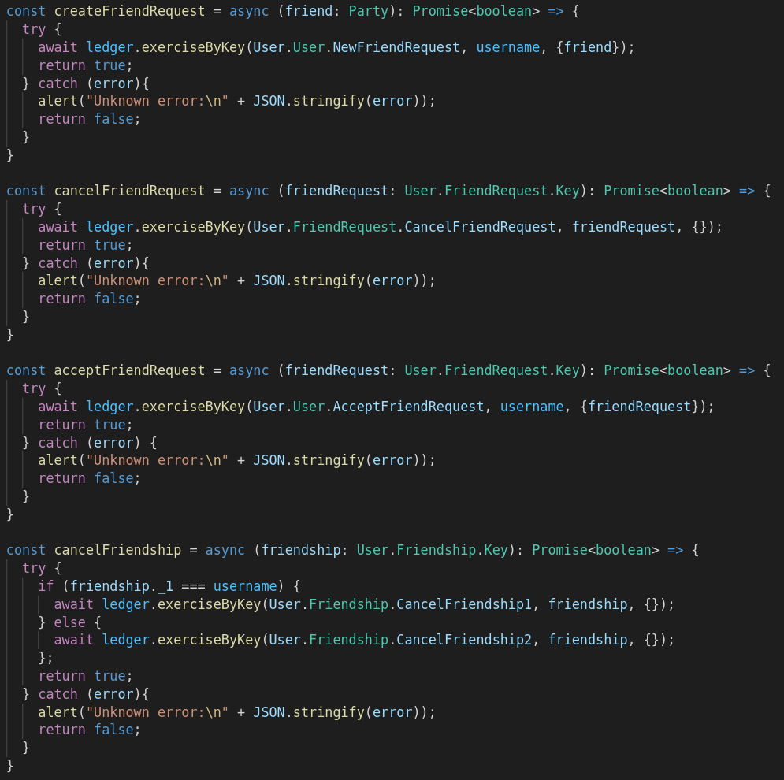

The new DAML model is complete and tested. Now it's time to include the new `FriendRequest` feature
in the UI.

You can find the updated UI in the `ui` directory. Have a look at
`ui/src/components/MainView.tsx`{{open}}. We included 4 new functions to create/cancel
`FriendRequests` and accept/cancel `Friendships`:



- We make use of the defined contract keys and only use `exerciesByKey`.
- In `cancelFriendship` we need to make sure we call the right `CancelFriendship` choice for the
  acting user. We can do this by comparing the `username` with the first factor of the `Friendship`
  contract key.

To display the list of friends, received and sent friend requests, we use queries:


- We use `useStreamQuery` to continuously update the results in the UI. 
- We filter the results by comparing the `username` to the returned keys.

To display (outstanding) friend requests, we wrote two new React components
`ui/src/components/FriendRequestList.tsx`{{open}} and
`ui/src/components/OutsandingFriendRequestList.tsx`{{open}}.

These are straight forward components that display the requests and have a button to cancel them.

Now compile your DAML model

```
cd create-daml-app
daml build
```{{execute T1}}

then generate the new JavaScript bindings with

```
daml codegen js .daml/dist/create-daml-app-0.1.0.dar -o daml.js
```{{execute T1}}

and install them

```
cd ui
yarn install
cd ..
```{{execute T1}}

Finally, start the sandbox

```
daml start
```{{execute T1}}

and the new UI in the second terminal

```
cd create-daml-app/ui
yarn start
```{{execute T2}}
