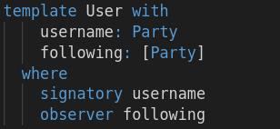
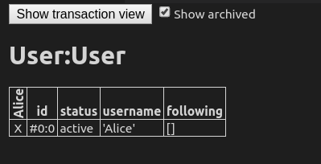

The analog of UNIX's read access right is the `observer` field in DAML. If you look at the `User`
contract template you see the line

<pre>
observer following
</pre>

in the template definition

after the `where` keyword. This means that all party's that are element of the `following` field of
the contract are allowed to read, or in DAML speak *observe* the `User` contract.

Observers need to be specified in terms of fields of type `Party` of the contract template. Again,
this is because actual party identifiers are not available at the time you write a DAML model, but
are created on the actual underlying ledger after the DAML model has been deployed. This is similar
to specifying the UNIX access rights without knowing the names of the users on the system. The only
choice you have is to specify the rights in terms of the file contents.

If you click on the `Scenario results` above the test scenario you see that currently there is one
active `User` contract, and `Alice` is the only party to observe it.

Who is observing what contract is indicated by the `X` under the parties name.

Now let `Alice` delete that contract and create one with the other two parties as followers. Replace
the last line in the scenario with

<pre class="file" data-target="clipboard">
  c0 <- submit alice $ create User with username = alice, following = []
  submit alice $ archive c0
  submit alice $ create User with username = alice, following = [bob, charlie]
</pre>

The table view changes to

You can see that the new `User` contract is not only observed by `Alice`, but also by `Bob` and
`Charlie` because they are in the `following` field and hence declared as observers by the line

<pre>
observer following
</pre>

The previous contract got archived and is still only observed by `Alice`.
